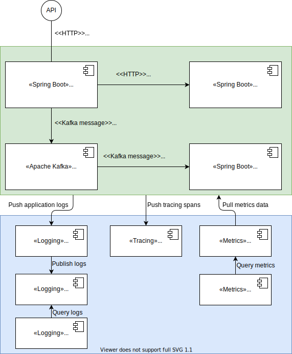

# Spring Boot Observability
A collection of Spring Boot sample projects and infrastrusture to demonstrate observability.

## What is Observability?
[Observability](https://www.ibm.com/cloud/learn/observability) provides deep visibility into modern distributed applications for faster, automated problem identification and resolution.

The cornerstones of Observability are:
- **Logging** -  Logs are granular, timestamped, complete and immutable records of application events. Among other things, logs can be used to create a high-fidelity, millisecond-by-millisecond record of every event, complete with surrounding context, that developers can 'play back' for troubleshooting and debugging purposes.
- **Metrics** - Metrics(sometimes called time series metrics) are fundamental measures of application and system health over a given period of time, such as how much memory or CPU capacity an application uses over a five-minute span, or how much latency an application experiences during a spike in usage.
- **Tracing** - Traces record the end-to-end 'journey' of every user request, from the UI or mobile app through the entire distributed architecture and back to the user.
- **Dependencies** (also called dependency maps) reveal how each application component is dependent on other components, applications and IT resources.

## Technologies to implement observability
In our demo application we are going to use the following Spring Boot friendly technologies to implement observability.

### Logging
- **[logstash-logback-encoder](https://github.com/logfellow/logstash-logback-encoder)** - Used to output application console logs in JSON format to improve indexing of logs in Elastic. Also used to push logs to from the Spring Boot application to Logstash. 
- **[Logstash](https://www.elastic.co/logstash/)** - To receive logs from Spring Boot applications and send the logs to ElasticSearch 
- **[ElasticSearch](https://www.elastic.co/elasticsearch/)** - To ingest, store and index logs.
- **[Kibana](https://www.elastic.co/kibana/)** - To visualise and query the log data in ElasticSearch.

### Metrics
- **[spring-boot-starter-actuator](https://docs.spring.io/spring-boot/docs/current/reference/html/actuator.html#actuator)** - Expose Spring Boot production ready management features via a specific URL.
- **[micrometer-registry-prometheus](https://micrometer.io/docs/registry/prometheus)** - Library to expose Spring Boot Actuator metrics information on a Prometheus compatable URL endpoint.
- **[Prometheus](https://prometheus.io/)** - Used to scape and persist metrics data in its time series database.
- **[Grafana](https://grafana.com/grafana/)** - Used to build and present metrics dashboards based on metrics data from Prometheus.

### Tracing
- **[spring-cloud-starter-sleuth](https://spring.io/projects/spring-cloud-sleuth)** - Used to generate and propagate traceIDs and spanIDs between Spring Boot applications. 
- **[spring-cloud-sleuth-zipkin](https://spring.io/projects/spring-cloud-sleuth)** - Used to push Sleuth tracing information to a Zipkin compatible endpoint of Jaeger.
- **[Jaeger](https://www.jaegertracing.io/)** - Used to persist and query tracing information.

### Dependencies
This demo will strictly speaking not cover the dependencies cornerstone, but the tracing cornerstone will provide some insights into dependencies.

## Running the demo
The demo application uses the following design:
 

The following software will be required to run the demo on your own machine.

- Java 17
- Apache Maven 3.8.1 or later
- Java IDE
- Docker and Docker Compose

### Environment Setup Instructions
The following instuctions will get an environment up and running in order to run the demo.

1. Navigate to the infrastructure folder under the root folder of this project.
2. Modify the **.env** file and update the property **app_server_ip** to the IP address of the network connection to access your Docker environment. For Windows 10 running Docker within a WSL environment, this is the **IPv4 Address** of the WSL virtual eternet adapter.
3. Run the command: `docker compose up -d`  
   For Windows 10 running Docker within a WSL environment, run this command within WSL.
4. Wait for the Docker containers to start up.

### Environment Access Details
The following URLs can be used to access the various Docker containers started above.

1. **Kibana** - http://localhost:5601/app/logs/stream
2. **Jaeger** - http://localhost:16686/search
3. **Prometheus** - http://localhost:9090/targets?search=
4. **Grafana** - http://localhost:3000/dashboards  
   Username: admin  
   Password: grafana
5. **Apache Kafka** - http://localhost:3030/

### Running Spring Boot Applications
The demo consists of 3 Spring Boot applications in sub folders in the root of the project. these are:
-  product-service
-  order-service
-  notification-service

To start these Spring Boot applications:
1. Navigate to the folder of each application.
2. Run the following command: `mvn spring-boot:run`
3. Alternatively the applications can be run using the Java IDE.
4. After starting the applications, you should be able to see in the Prometheus targets interface whether the application metrics are being successfully collected by Prometheus.

### Testing the applications
The **order-service** exposes a Swagger UI at http://localhost:8580/actuator/swagger-ui that can be used to test the application.